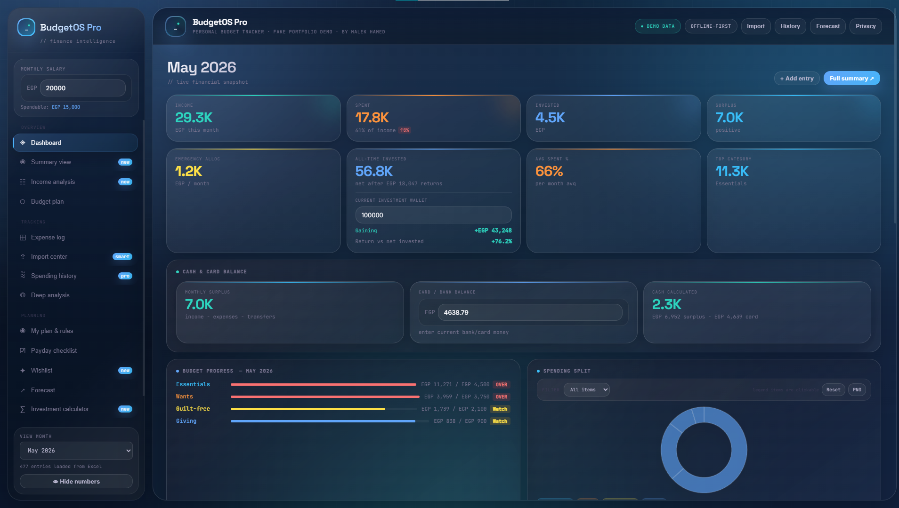
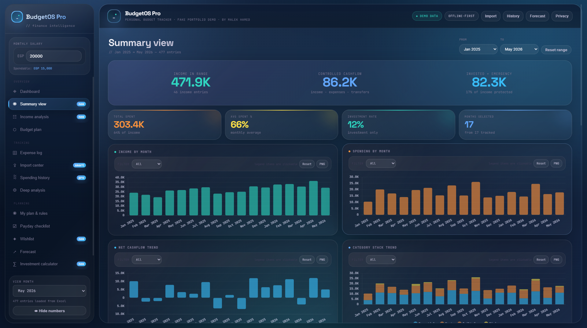
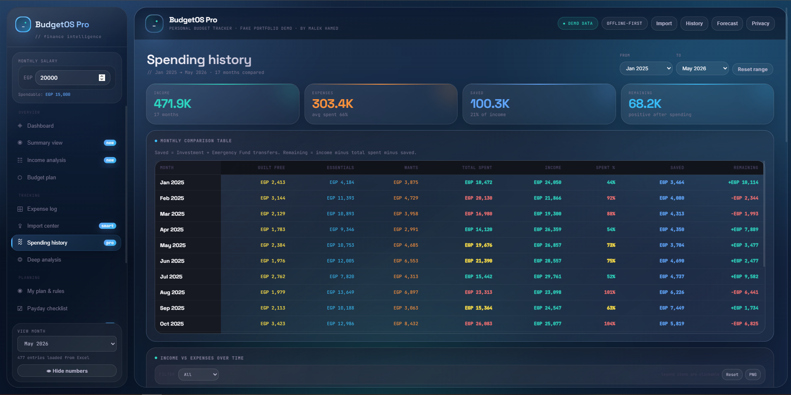
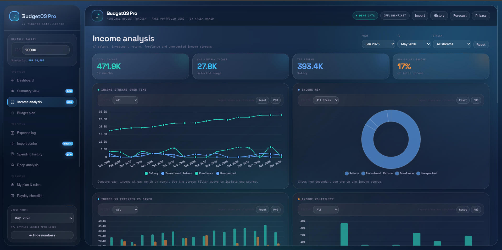
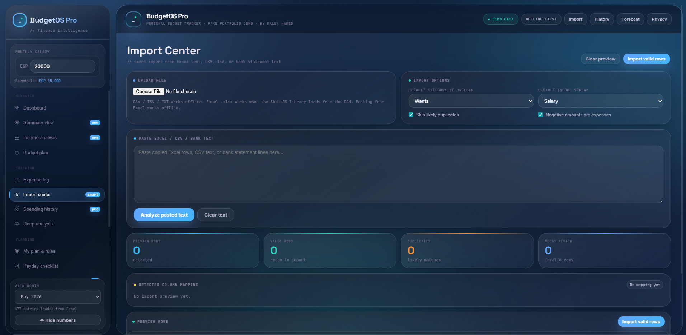
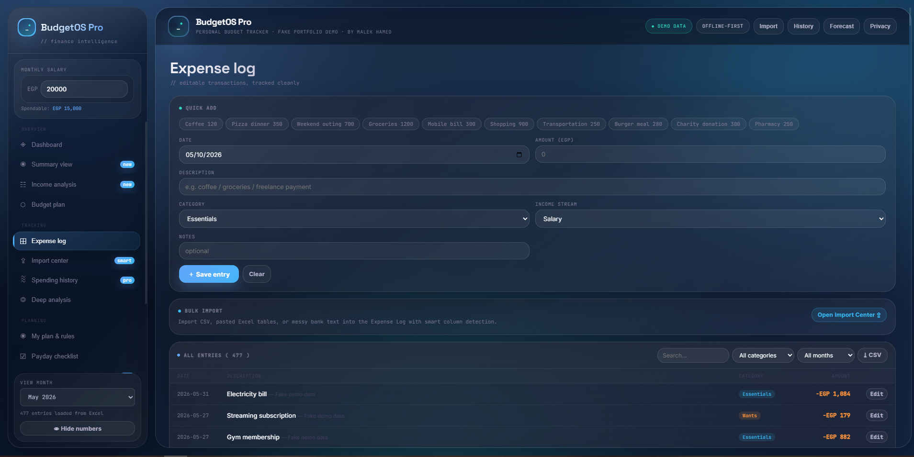
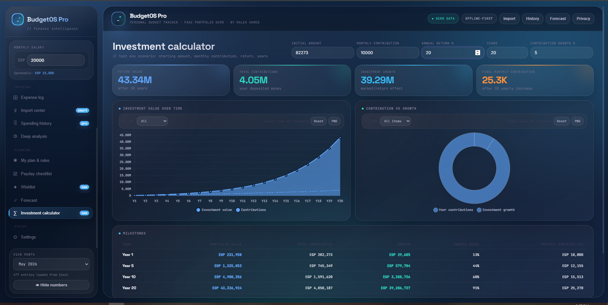
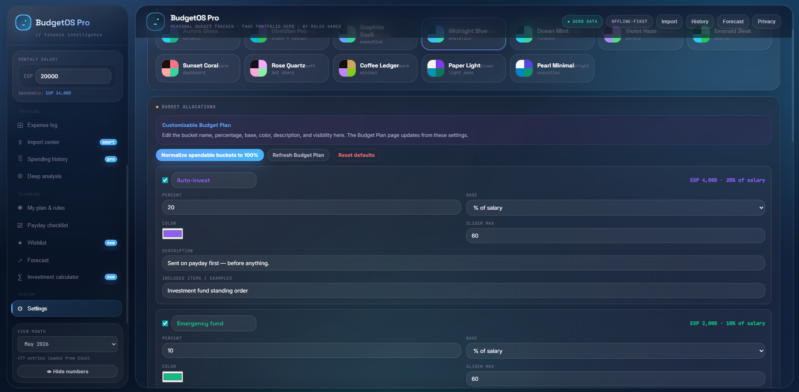
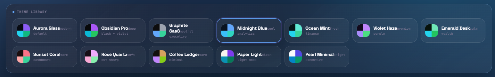
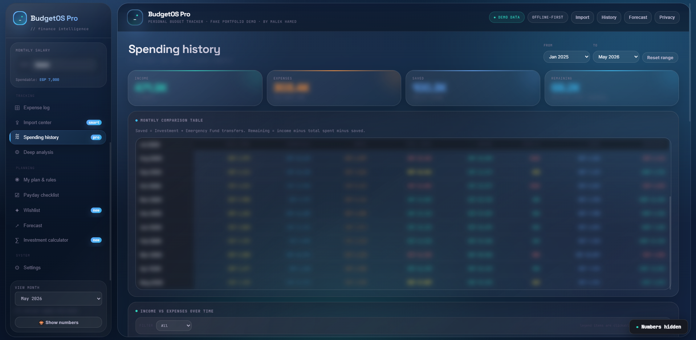

<div align="center">

# 💸 BudgetOS Pro  
### Personal Budget Tracker & Finance Analytics Web App

A modern offline-first personal finance operating system that turns transaction-level data into dashboards, spending insights, budget planning, wishlist tracking, and investment forecasts.

<br>



<br>

[](#)
[](#)
[](#)
[](#)
[](#)

<br>

**Live Demo:** Add your GitHub Pages link here  
**Status:** Portfolio Demo  
**Data:** Fake English Demo Data  

</div>

---

## ✨ Overview

**BudgetOS Pro** is a browser-based personal finance analytics app designed to answer one question:

> How can daily financial transactions become clear financial decisions?

Instead of only recording expenses, the app helps users understand financial behavior across:

- income
- spending
- savings
- investments
- emergency fund usage
- wishlist planning
- long-term forecasting

The public demo uses **fake English data** to protect privacy while still showing realistic financial patterns.

---

## 🚀 Key Highlights

| Feature | What it does |
|---|---|
| 📊 Dashboard | Shows monthly income, expenses, surplus, budget pressure, and cash/card balance |
| 🧾 Expense Log | Add, edit, delete, filter, and export transactions |
| 📥 Import Center | Import CSV, Excel text, TSV, TXT, and messy table data |
| 💰 Income Analysis | Analyze salary, freelance, investment return, and unexpected income |
| 📆 Spending History | Compare month-by-month income, expenses, saving, and remaining balance |
| 🧠 Category Analysis | Uses descriptions as subcategories to detect exact spending habits |
| 🎯 Budget Plan | Customize allocations for essentials, wants, guilt-free, giving, investments, and emergency fund |
| 🧯 Emergency Fund | Track emergency savings and emergency-funded expenses |
| 🛒 Wishlist | Plan future purchases and convert bought items into expense log entries |
| 📈 Forecast | Project 1, 5, 10, and 20 year outcomes using investment compounding |
| 🧮 Investment Calculator | Simulate investment growth using monthly compounding |
| 🙈 Privacy Mode | Hide sensitive numbers while sharing or presenting |
| 🎨 Theme Showcase | Switch between modern themes with matching dashboard and chart colors |

---

## 🧩 Tech Stack

| Area | Technology |
|---|---|
| Structure | HTML |
| Styling | CSS |
| Logic | JavaScript |
| Charts | Chart.js |
| Excel Import | XLSX Parser |
| Storage | LocalStorage |
| Architecture | Offline-first single-page app |

---

## 🖼️ Screenshots

> Make sure the image files are inside a folder called `screenshots` in the same repo level as `index.html`.

### 1. Dashboard


The main financial snapshot showing income, spending, surplus, budget progress, and spending split.

---

### 2. Summary View



A high-level overview with date filters, net cashflow, top expenses, best/worst months, and financial health scorecard.

---

### 3. Spending History



Month-by-month comparison of income, expenses, saved amount, remaining balance, and category behavior.

---

### 4. Category Analysis


Uses transaction descriptions as subcategories to detect repeated spending habits and biggest leaks.

---

### 5. Income Analysis



Breaks income into salary, freelance, investment return, and unexpected income streams.

---

### 6. Import Center



Smart import workflow for CSV, Excel text, TSV, TXT, and messy financial tables.

---

### 7. Wishlist


Plan future purchases, estimate prices, set priority, and convert bought items into expense log entries.

---

### 8. Expense Log



Editable transaction log with search, filters, categories, income streams, and export options.

---

### 9. Forecast


Projects future wealth for 1, 5, 10, and 20 years using investment compounding.

---

### 10. Investment Calculator



Simulates investment growth using starting amount, monthly contribution, annual return, and contribution growth.

---

### 11. Settings & Themes



Theme library and budget allocation settings.

---

### 12. Theme Showcase



A dedicated screenshot to show the available modern themes and how the app style changes across themes.

---

### 13. Privacy Mode Button


Shows the eye/privacy button used to hide sensitive numbers before sharing the screen or taking screenshots.

---

### 14. Privacy Mode Active



Shows the dashboard or analysis screen with financial numbers blurred for privacy.

---

## 🧠 Core Logic

### Monthly Surplus

```text
Monthly Surplus = Income - Expenses - Transfers
```

### Cash Calculation

```text
Cash = Monthly Surplus - Card / Bank Balance
```

### Available Funds

```text
Available Funds = Total Income + Previous Month Balance
```

### Real Income

```text
Total Income = Salary + Freelance + Investment Return + Unexpected
```

Previous Month Balance is treated as carryover, not real income.

### Emergency Fund Balance

```text
Emergency Fund Balance =
Emergency Fund Transfers - Expenses Paid From Emergency Fund
```

### Forecast Monthly Return

```text
Monthly Return = (1 + Annual Return) ^ (1 / 12) - 1
```

### Forecast Scenarios

```text
Base Case = User annual return
Worst Case = User annual return - 10 percentage points
Best Case = User annual return + 10 percentage points
```

---

## 🗂️ Data Model

The app is built around transaction-level records.

| Field | Description |
|---|---|
| `date` | Transaction date |
| `description` | Transaction name |
| `amount` | Transaction amount |
| `category` | Main category |
| `type` | Income, Expense, or Transfer |
| `incomeStream` | Salary, Freelance, Investment Return, Unexpected, Previous Month Balance |
| `fundingSource` | Main Budget or Emergency Fund |
| `notes` | Optional notes |

---

## 📄 Page Documentation

<details>
<summary><strong>📊 Dashboard</strong></summary>

The Dashboard gives the current financial snapshot.

Main functions:

- monthly income
- monthly spending
- investment amount
- surplus/deficit
- budget progress
- spending split
- recent entries
- cash and card balance

Best screenshot: `Screenshots/dashboard.png`

</details>

<details>
<summary><strong>🧾 Expense Log</strong></summary>

The Expense Log is the transaction management page.

Main functions:

- add transaction
- edit transaction
- delete transaction
- search
- filter
- export CSV
- choose income stream
- choose funding source

Best screenshot: `Screenshots/expense-log.png`

</details>

<details>
<summary><strong>📥 Import Center</strong></summary>

The Import Center converts external data into valid tracker records.

Supported formats:

- CSV
- TSV
- TXT
- pasted Excel table
- XLSX files
- messy bank-statement-like text

Best screenshot: `Screenshots/import-center.png`

</details>

<details>
<summary><strong>💰 Income Analysis</strong></summary>

Income Analysis breaks income into streams.

Streams:

- Salary
- Freelance
- Investment Return
- Unexpected
- Previous Month Balance

Best screenshot: `Screenshots/income-analysis.png`

</details>

<details>
<summary><strong>📆 Spending History</strong></summary>

Spending History compares monthly financial behavior.

Tracks:

- Guilt-free
- Essentials
- Wants
- Total Spent
- Income
- Spent %
- Saved
- Remaining

Best screenshot: `Screenshots/spending-history.png`

</details>

<details>
<summary><strong>🧠 Category Analysis</strong></summary>

Category Analysis uses descriptions as subcategories.

Example:

```text
Category: Guilt-free
Subcategory: Coffee
```

This helps identify exact repeated habits, not only broad categories.

Best screenshot: `Screenshots/category-analysis.png`

</details>

<details>
<summary><strong>🛒 Wishlist</strong></summary>

Wishlist helps plan future purchases.

Main functions:

- add item
- expected price
- priority
- target month
- edit item
- delete item
- mark as bought
- auto-add bought item to Expense Log

Best screenshot: `Screenshots/wishlist.png`

</details>

<details>
<summary><strong>🙈 Privacy Mode</strong></summary>

Privacy Mode helps users present or share the dashboard without exposing sensitive financial values.

Main functions:

- hide or blur sensitive financial numbers
- blur chart data
- toggle visibility using the eye icon
- allow temporary reveal on hover
- protect numbers during screenshots, screen sharing, or portfolio demos

Recommended screenshots:

```text
Screenshots/privacy-button.png
Screenshots/privacy-mode-active.png
```

</details>

<details>
<summary><strong>🎨 Themes</strong></summary>

The theme system lets users switch between multiple modern visual styles.

Main functions:

- modern theme library
- dashboard colors change with selected theme
- charts adapt to theme colors
- light and dark visual styles
- better portfolio presentation flexibility

Recommended screenshot:

```text
Screenshots/theme-showcase.png
```

</details>

<details>
<summary><strong>📈 Forecast</strong></summary>

Forecast estimates future outcomes across:

- 1 year
- 5 years
- 10 years
- 20 years

It uses historical averages and investment compounding.

Best screenshot: `Screenshots/forecast.png`

</details>

<details>
<summary><strong>🧮 Investment Calculator</strong></summary>

The Investment Calculator simulates growth based on:

- initial amount
- monthly contribution
- annual return
- years
- contribution growth

Best screenshot: `Screenshots/investment-calculator.png`

</details>

---

## 🧪 How to Run Locally

1. Download or clone the repository.
2. Open `index.html` in your browser.
3. The app will load fake demo data automatically.
4. No backend setup is required.

```bash
git clone https://github.com/YOUR-USERNAME/personal-budget-tracker.git
cd personal-budget-tracker
```

Then open:

```text
index.html
```

---

## 🌍 How to Publish with GitHub Pages

1. Rename the main file to:

```text
index.html
```

2. Upload it to a public GitHub repository.
3. Go to:

```text
Settings → Pages
```

4. Select:

```text
Deploy from branch
Branch: main
Folder: /root
```

5. Save and open the generated GitHub Pages link.

---

## 🎯 Portfolio Case Study Summary

### Problem

Most budgeting tools record expenses, but they do not clearly explain behavior or connect spending with future financial planning.

### Solution

I built an offline-first finance analytics web app that organizes transactions, analyzes financial behavior, manages planned purchases, and forecasts investment growth.

### My Role

I designed and built:

- UI layout
- dashboard structure
- data model
- import workflow
- KPI calculations
- forecasting logic
- wishlist logic
- chart interactions

### Skills Demonstrated

- Data cleaning
- KPI design
- Dashboard storytelling
- Financial analysis
- JavaScript logic
- Data modeling
- UX design
- Product thinking
- Forecast modeling

---

## 📌 Recommended Screenshots for Documentation

| Priority | Screenshot | File Name | Why it matters |
|---|---|---|---|
| 1 | Dashboard | `dashboard.png` | First impression |
| 2 | Spending History | `spending-history.png` | Shows analytical depth |
| 3 | Category Analysis | `category-analysis.png` | Shows behavior insights |
| 4 | Import Center | `import-center.png` | Shows data cleaning logic |
| 5 | Income Analysis | `income-analysis.png` | Shows income stream thinking |
| 6 | Wishlist | `wishlist.png` | Shows product thinking |
| 7 | Forecast | `forecast.png` | Shows financial modeling |
| 8 | Investment Calculator | `investment-calculator.png` | Shows compounding logic |
| 9 | Expense Log | `expense-log.png` | Shows CRUD functionality |
| 10 | Settings | `settings.png` | Shows customization |
| 11 | Theme Showcase | `theme-showcase.png` | Shows visual customization |
| 12 | Privacy Button | `privacy-button.png` | Shows the privacy control |
| 13 | Privacy Mode Active | `privacy-mode-active.png` | Shows sensitive numbers blurred |

---

---

## 📁 Required Screenshot File Structure

To make images appear correctly on GitHub, keep the folder name and file names exactly like this:

```text
personal-budget-tracker/
│
├── index.html
├── README.md
└── Screenshots/
    ├── dashboard.png
    ├── summary-view.png
    ├── spending-history.png
    ├── category-analysis.png
    ├── income-analysis.png
    ├── import-center.png
    ├── wishlist.png
    ├── expense-log.png
    ├── forecast.png
    ├── investment-calculator.png
    ├── settings.png
    ├── theme-showcase.png
    ├── privacy-button.png
    └── privacy-mode-active.png
```

GitHub is case-sensitive, so `Screenshots/` must match the folder name exactly.


## 🔮 Future Improvements

- Convert to React or Next.js
- Add secure backend storage
- Add user authentication
- Add cloud backup
- Add AI-assisted import through a backend API
- Add recurring transactions
- Add multi-currency support
- Add PWA installation
- Add real bank statement templates
- Add downloadable reports

---

## ⚠️ Disclaimer

This project is for portfolio and educational purposes only.  
It is not financial advice.

---

<div align="center">

### Built as a finance analytics portfolio project

**BudgetOS Pro — Personal Budget Tracker**

</div>
